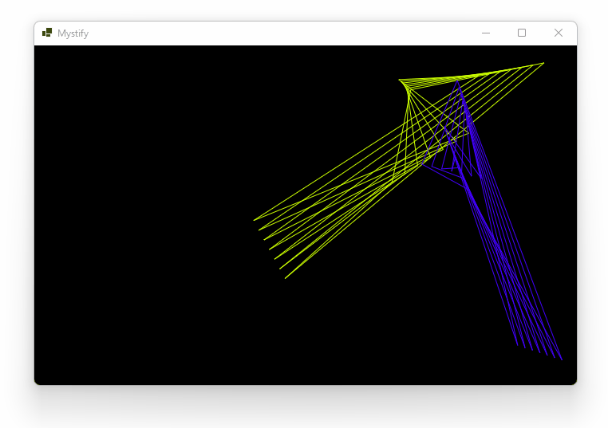

# Mystify

**This project is a modern C# implementation of the classic Windows screensaver _Mystify Your Mind_.** SkiaSharp is used to draw graphics (with optional OpenGL acceleration) and video file export is provided by FFMpeg.

**Download:** [64-bit EXE for Windows on the Releases page](https://github.com/swharden/Mystify/releases)

