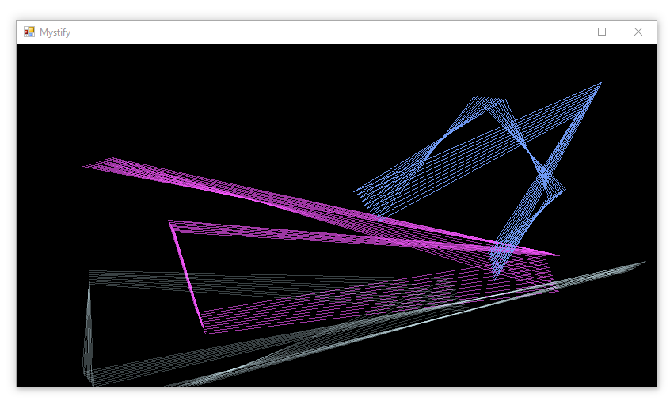

# Mystify

This project contains source code for a modern implementation of the classic Mystify screensaver from Windows 3.1 written in C#. [This YouTube Video](https://www.youtube.com/watch?v=uZQr-gHyYFI) demonstrates what the original screensaver looked like when it was released with Windows XP.

Feature | Original Screensaver | This Version
---|---|---
max number of polygons|2|9999
colors available|16 predefined|RGB color chooser
corners per polygon|5 (fixed)|2-9999
max lines per polygon|15|1-9999

**Motivation:** This project is intended to be an exercise to practice clean code and SOLID object-oriented design. It is an interesting challenge to extend the features beyond those of the original screensaver, and also tilt between procedural and functional programming styles while balancing the use of classes vs. structs.